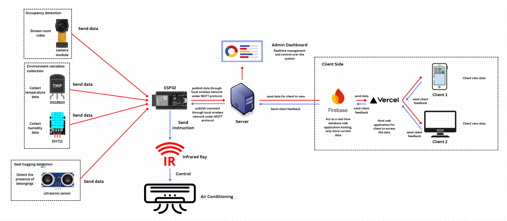

# 🏗️ SCADA-i — Supervisory Control and Data Acquisition - Intelligence System

> **An IoT-supported, AI-driven Building Management System for Campus Resource Optimization**

## 📱Figma Prototype
Link to the Figma prototype:

[Dashboard](https://www.figma.com/proto/2IgBJD8xzPYUQsibwKqplg/BugSolver?node-id=0-1&t=NZIzghUPB14tYiao-1)

[Mobile Monitor App](https://www.figma.com/proto/2IgBJD8xzPYUQsibwKqplg/BugSolver?node-id=1-2&t=NxiNEqSXgTG1WxAt-1)

## 📝 Project Description

**SCADA-i** is an **IoT-based SCADA-BMS system** enhanced with **predictive AI** for smarter building maintenance. The **hardware setup** integrates multiple **ESP32 microcontrollers**, including an **ESP32-CAM** running a **YOLO object detection CV model** for **accurate occupancy detection**. Supporting sensors include **multiple ultrasonic modules** for **seat-hogging prevention and monitoring**, and a **DHT11 sensor** for **real-time temperature and humidity measurement**. Data from all sensors is transmitted via an **MQTT broker over Wi-Fi** to a **backend system**, whereby **three distinctive ML predictive models** will estimate **occupancy trends**, **time-to-cool timings**, and **optimal thermal comfort levels**. The **embedded system** will monitor **environmental and usage conditions**; thus through such monitoring, enable **automated control actions** for **HVAC**, **lighting**, and **power systems** in its designated room. By combining the **reliability of traditional SCADA-BMS systems** with **CV** and **AI-driven predictions**, our system provides a **robust, scalable, and intelligent solution** for **next-generation smart buildings**.

Our mission:  
> *Create a more sustainable, energy-efficient, and comfortable campus environment for students, faculty, and staff — powered by intelligence, not intuition.*

---

## ✨ Key Features

**Real-time HVAC Optimization**  
AI models dynamically adjust temperature, airflow, and humidity based on occupancy, weather, and historical patterns.

**Live Occupancy Monitoring**  
Computer vision and sensor fusion provide accurate, real-time room usage data — accessible via dashboard or mobile app.

**Predictive Pre-Cooling**  
Machine learning predicts future occupancy and triggers pre-cooling cycles to ensure comfort while minimizing energy waste.

**MQTT-Based Hardware Interface**  
Lightweight, low-latency communication with physical HVAC controllers and environmental sensors via MQTT protocol.

**Seamless IoT Device Integration**  
Plug-and-play support for heterogeneous sensors and actuators — including ESP32, DHT11, ultrasonic modules, relays, and smart switches — enabling flexible, scalable deployment across diverse building environments.

---

## ⚙️ Architecture Block Diagram



### 🛠️ Usage Example
#### Once deployed, SCADA-i:

**1) Detects people via ESP32-CAM + YOLO**  
**2) Monitors seat usage via ultrasonic sensors**  
**3) Logs temp/humidity via DHT11 and DS18B20**  
**4) Sends all data → MQTT → SQLite → ML models**  
**5) Models trigger HVAC pre-cooling or temperature adjustments based on predictions**  
**6) Facility managers view analytics via dashboard**  
**7) CLient view real-time occupancy information through mobile applciation**  

*The system integrates hardware sensors, edge computing, machine learning, and user interfaces into a seamless intelligent control loop.*

---

## ⚙️ Hardware Used
| Hardware               | Functions                         |
|---------------------|--------------------------------------------|
| **ESP32 CAM**           | Run YOLO object detection CV model for accurate occupancy detection    |
| **DHT11**        | Real-time temperature and humidity measurement      |
| **DS18B20**        | Real-time temperature measurement  |
| **Ultrasonic sensor**          | Seat-hogging prevention      |
| **Infrared ray blaster**          | Control air conditioner      |

## 💻 Technology Stack

| Layer               | Technologies Used                          |
|---------------------|--------------------------------------------|
| **AI/ML**           | Scikit-learn, XGBoost, LightGBM, OpenCV, Pandas    |
| **IoT/Edge**        | MQTT, ESP32, Raspberry Pi, Sensor APIs      |
| **Database**        | Firebase Realtime DB, Firestore, SQLite |
| **DevOps**          | Git, VSCode     |

---

## 📂 File Structure
```
SCADA-i/
├── firebase_api/ # Firebase api scripts
├── hardware_interface/ # MQTT clients, sensor interface drivers
├── machine_learning/ # Occupancy, time-to-cool, temperature control models
└── occupancy_cv/ # YOLO model for occupancy detection
```

---

## ⬇️ Installation & Setup

**Clone repo**
   ```bash
   git clone https://github.com/yx-05/SCADA-i.git
   ```
---
