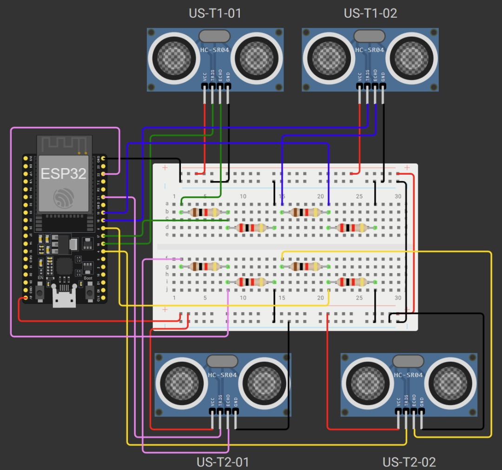
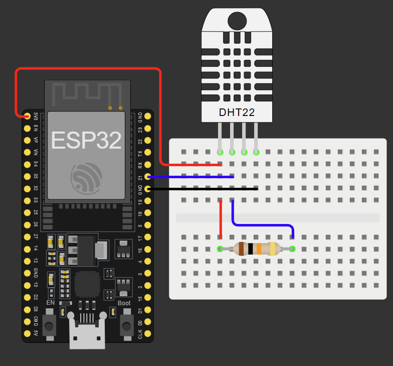
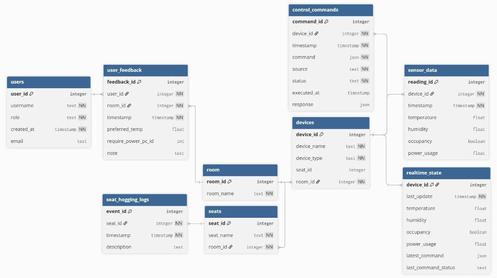

# Hardware-Software Interfacing

This section of the prototype includes all relevant code, structural logics, and controls related to the IoT hardware for SCADA-i. This includes the actual hardware control .ino files, the MQTT Broker Python backend, the local backend database, as well as the ESP32-CAM interfacing logic and setup.

---

## Architecture Overview
The following section will further detail the specific architectures of hardware integration: the first being the circuitry schematic diagrams to connect the IoT sensors with the respective ESP32s. 





Further simplification to the design will be done during deployment, but the diagram serves as a good reference point to start design changes. The following daigram will also show the backend database's architecture for subsequent reference during further interfacing during deployment.



## 📂 Project Files

```
.
├── ino_control/                                # for all sensor hardware logic
├── mqtt_connection.py                          # to initialise and connect to the MQTT broker
├── BackendDatabase.db                          # sqlite database to store historical logs
├── README.md                                   # documentation for hardware interfacing
├── dht11_temp_sensor_circuit_diagram.png       # diagram showing circuitry for DHT11 sensor
└── seat_hogging_sensor_circuit_diagram/jpg     # diagram showing circuitry for ultrasonic sensors
```
