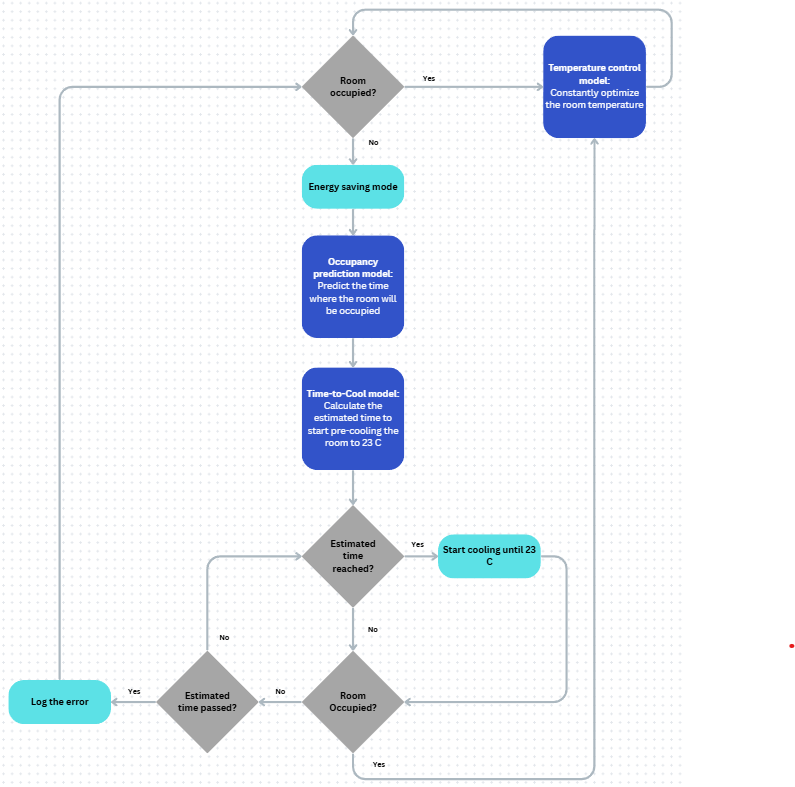

# ❄️ Smart Room Temperature Control

This part of the system implements an intelligent climate control system for indoor environments, leveraging machine learning models to optimize energy usage and occupant comfort. The system dynamically adjusts room temperature based on occupancy predictions and pre-cooling strategies.

---

## Architecture Overview
The system follows a decision-based architecture designed to balance energy efficiency with user comfort:



### Workflow

**1. Occupancy Detection**: The system first checks if the room is currently occupied

**2. Temperature Control**: If occupied, the temperature control model continuously optimizes room temperature

**3. Energy Saving Mode**: If unoccupied, the system enters energy saving mode

**4. Occupancy Prediction**: The occupancy prediction model forecasts when the room will be occupied

**5. Pre-Cooling Calculation**: The "Time-to-Cool" model calculates the optimal time to start pre-cooling to reach 23°C

**6. Cooling Execution**: The system starts cooling when the estimated time is reached

**7. Error Handling**: If the estimated time passes without occupancy, the system logs the error

---

## 📂 Project Files

```
.
├── dataset/           # Training data for the ML models
├── models/            # Trained machine learning models
├── README.md          # Project documentation
└── ml_block_diagram.png  # Architecture diagram
```

---

## 🚀 Key Components

**Temperature Control Model**: Continuously optimizes room temperature when occupied

**Occupancy Prediction Model**: Predicts future occupancy patterns

**Time-to-Cool Model**: Calculates optimal pre-cooling start times

---


