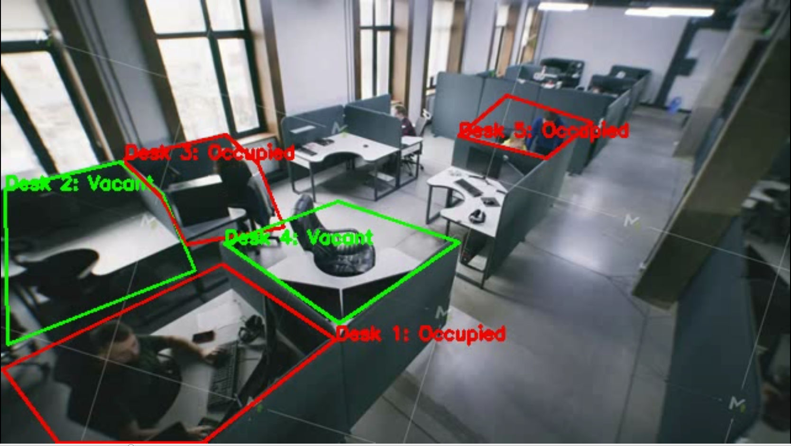

# Seat Occupancy Detection

[](https://www.python.org/)

## Overview
This module detects **seat occupancy** in video streams using YOLO-based computer vision.

It provides real-time occupancy data to optimize **campus resources**. The module aims to process **live camera streams**, and can log or upload results for analytics. The functionality is shown by processing a pre-record video as prototype.

---

## Features
- Detect occupancy in videos using YOLO
- Annotate video frames with bounding boxes and occupancy status for visualization
- JSON logging of occupancy events (`log.json`)

---

## Files 
- `desk_roi_pos.json` → define desk positions for accurate detection
- `log.json` → auto-generated; logging the occupancy of each seat and send to the main system
- `yolo_cv_prototype_video.py` → main entry point for video processing 

---

## Installation
Navigate to this module folder:
```bash
cd desk_occupancy
pip install -r requirements.txt
```
---

## Configuration to run the code
Change *video_path* and *desk_rois_path* in `yolo_cv_prototype_video.py` to the destination for `test.mp4` and `desk_roi_pos.json` before running.
Run `yolo_cv_prototype_video.py` with python

---

## Input
`test.mp4` → cctv footage by Framestock Footages

---

## Sample Output
`sample_output.mp4` output video for occupancy detection with annotation to visualize the detection



---

## Log file
`log.json` auto-generated log file to store the occupancy status of each seat during the video streaming


